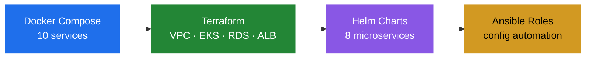

# 👋 Hi, I'm Lokesh

**DevOps / SRE / Platform Engineer · AWS · Kubernetes · Terraform · Ansible · Helm · Docker**

`Automating infrastructure as code, one pipeline at a time`

[](https://www.linkedin.com/in/lokesh-lkh-b65322361/)

---

## 🚀 What I Build

I build **end-to-end infrastructure for microservices on AWS** — from the VPC up through
Kubernetes to the Helm charts that deploy the applications, plus the Ansible automation
that configures everything afterward.



---

## 🧰 Toolchain

| Category | Tools |
|---|---|
| **Cloud** | AWS (EC2, VPC, EKS, RDS, ALB, ACM, IAM, Route53, SSM) |
| **Infrastructure as Code** | Terraform · Helm · Ansible |
| **Containers** | Docker · Docker Compose · Kubernetes · EKS |
| **CI/CD** | GitHub Actions · Jenkins |
| **Languages** | Python · Bash · HCL |

---

## 📂 Featured Work

| Repo | What It Covers |
|---|---|
| **[terraform-aws-eks](https://github.com/lokesh-lkh/terraform-aws-eks)** | Full EKS infrastructure — blue-green SPOT node groups, Helm-deployed microservices, ALB ingress with TLS, Gateway API |
| **[terraform-aws-vpc](https://github.com/lokesh-lkh/terraform-aws-vpc)** | Production-ready VPC module — multi-AZ, 3-tier subnets, NAT gateway, optional VPC peering |
| **[ansible-roboshop-roles](https://github.com/lokesh-lkh/ansible-roboshop-roles)** | Role-based Ansible — dynamic AWS inventory, SSM-backed secrets, multi-runtime deployment |
| **[roboshop-docker](https://github.com/lokesh-lkh/roboshop-docker)** | 10-service microservices stack — Node, Java, Python with dependency orchestration |

---

## 💡 About Me

```yaml
name: Lokesh
role: DevOps / SRE / Platform Engineer
focus: AWS infrastructure, Kubernetes, automation
location: Bengaluru, India
status: Open to DevOps, SRE, AIOps and LLMOps roles
currently: Building infrastructure as code and exploring LLMOps
```

I got into DevOps through hands-on work rather than theory — provisioning networks,
debugging Terraform state, watching pods crash-loop, and automating away the repetitive
parts.

**Currently exploring:** LLMOps — deploying model inference services onto the same
Kubernetes infrastructure I already work with, and instrumenting them properly.

---

## 📈 Currently Learning

- **LLMOps** — model serving infrastructure, vector databases, inference observability
- **AIOps** — anomaly detection, incident prediction, metric correlation
- **GitOps** — ArgoCD, Flux
- **Observability** — Prometheus, Grafana, OpenTelemetry

---

## 📫 Let's Connect

[](https://www.linkedin.com/in/lokesh-lkh-b65322361/)
[](https://github.com/lokesh-lkh)

---

<div align="center">
  <sub>Built with curiosity · Always learning</sub>
</div>
